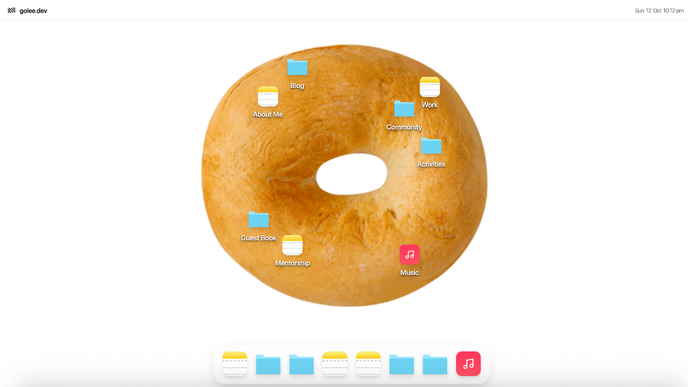

# BagelOS Portfolio


A macOS-inspired portfolio website built with React, TypeScript, and Cloudflare Stack (Pages, Workers, and D1). Features a desktop-like interface with draggable windows, a music player, analytics, and more.



## ✨ Features

### 🖥️ Desktop Experience

- **macOS-style Interface**: Draggable windows, dock, and menu bar
- **Responsive Design**: Fully optimized for mobile and desktop
- **Desktop Icons**: Click or double-click icons arranged in a bagel layout
- **Window Management**: Minimize, maximize, and resize windows
- **Sticky Notes**: Analytics and privacy notes with drag & expand functionality

### 📱 Core Sections

- **About**: Professional profile with experience timeline
- **Work**: Detailed work experience with achievements
- **Blog**: MDX-powered blog with syntax highlighting
- **Community**: Journey of building DefyDefault (11.5K+ members)
- **Activities**: Speaking engagements and media appearances
- **Mentorship**: Testimonials from mentees
- **Guestbook**: Interactive visitor comments with spam protection
- **Music**: YouTube-integrated music player

### 🔧 Technical Features

- **Analytics**: Privacy-focused visitor tracking with Cloudflare D1
- **Guestbook**: Real-time comments with rate limiting
- **SEO Optimized**: Dynamic OG images for social sharing
- **Accessibility**: ARIA labels and keyboard navigation
- **Performance**: Code splitting and lazy loading

## 🛠️ Tech Stack

### Frontend

- **React 18** - UI framework
- **TypeScript** - Type safety
- **Vite** - Build tool
- **TailwindCSS** - Styling
- **React Router** - Navigation
- **React Markdown** - Blog content rendering

### Backend & Infrastructure

- **Cloudflare Pages** - Static hosting
- **Cloudflare Workers** - Serverless API functions
- **Cloudflare D1** - SQLite database
- **Wrangler** - Cloudflare CLI tool

### Additional Libraries

- **YouTube IFrame API** - Music player
- **Lucide React** - Icons
- **Papaparse** - CSV parsing
- **Remark/Rehype** - Markdown processing

## 🔒 Privacy & Security

- No IP storage: Only country codes from Cloudflare headers
- Hashed fingerprints: SHA-256 hashing with custom salt
- Rate limiting: Server-side and client-side protection
- CORS headers: Proper CORS configuration
- Input sanitization: XSS prevention in guestbook
- CSP headers: Content Security Policy implementation

## ⚠️ Important Notice

This repository is primarily a **personal portfolio**, not a general-purpose template.  
You are welcome to explore the code, but **do not publish or deploy it as your own portfolio**.

If you’d like to build your own version, please:

- Use it as a reference or starting point
- Replace all personal data and media
- Credit the original author clearly

### Code License

The code of this project is licensed under the MIT License - you are free to use, modify, and distribute the code.

### Content License

All personal content including but not limited to:

- Blog posts and articles
- Work experience and achievements
- Personal images and media
- Community event descriptions
- Activity descriptions
- Mentorship testimonials
- Any biographical information

is protected by copyright and may **NOT** be reused, copied, or redistributed without explicit written permission.

### Attribution Requirement

If you fork or use this codebase:

1. You **MUST** provide clear attribution to the original author (Go Lee)
2. You **MUST** include a link to the original repository: https://github.com/goleedev/golee.me
3. You **MUST** replace all personal content with your own

🔔 Failure to provide attribution or remove personal content may constitute copyright infringement.

### Example Attribution

```
Based on [BagelOS Portfolio](https://github.com/goleedev/golee.me) by [Go Lee](https://golee.me)
See the LICENSE file for full details.
```

## 👤 Author

### Go Lee

- Website: [golee.me](https://golee.me)
- GitHub: [@goleedev](https://github.com/goleedev)
- LinkedIn: [Go Lee](https://linkedin.com/in/goleedev)

## 🙏 Acknowledgments

- Design inspiration from macOS Big Sur
- Community support from DefyDefault members
- Icons by Lucide
- Hosted on Cloudflare Pages

## 📧 Contact

For questions about using this codebase or licensing inquiries:

- Email: hey@golee.me
- Open an issue on GitHub

💬 If this project inspired you or helped you build your own,  
feel free to leave a note in the [Guestbook](https://golee.me/guestbook) — I’d love to hear from you!

---

Note: This is a personal portfolio. While the code is open source, please respect the author's personal content and provide proper attribution when using this codebase.
Retry
